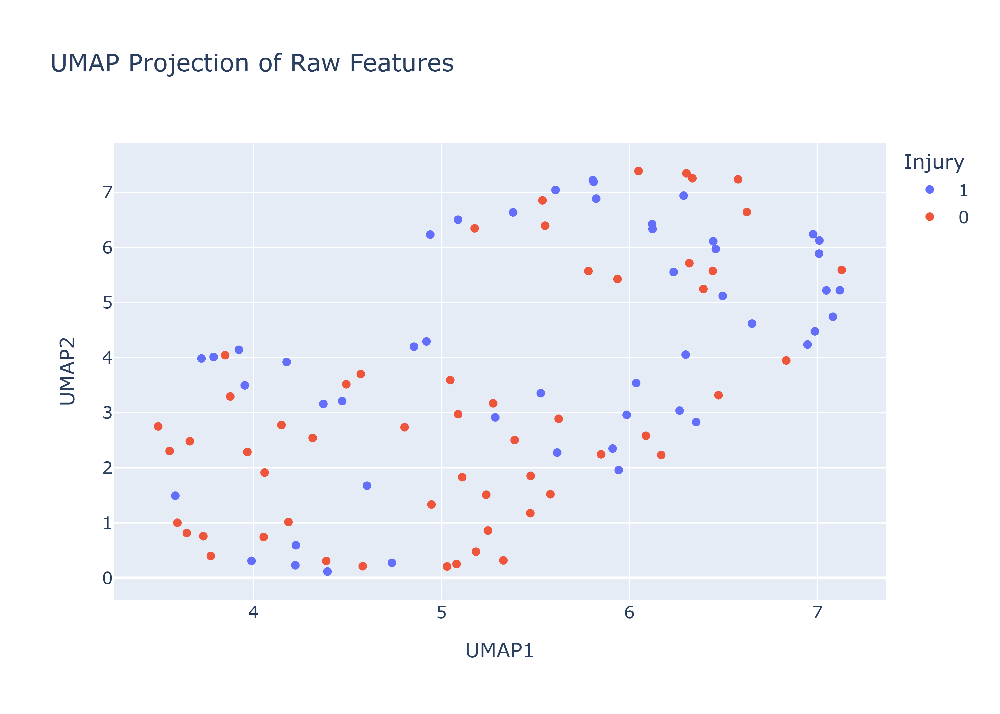
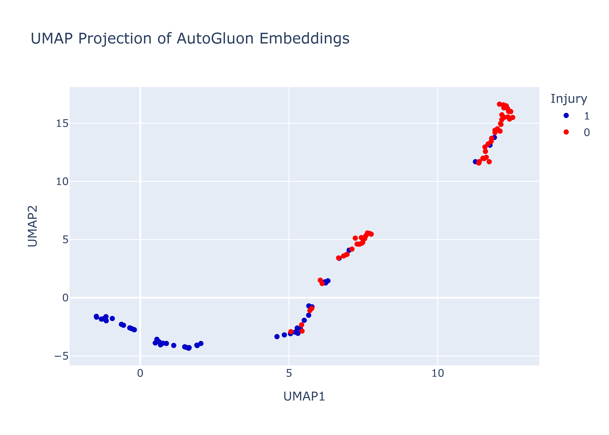
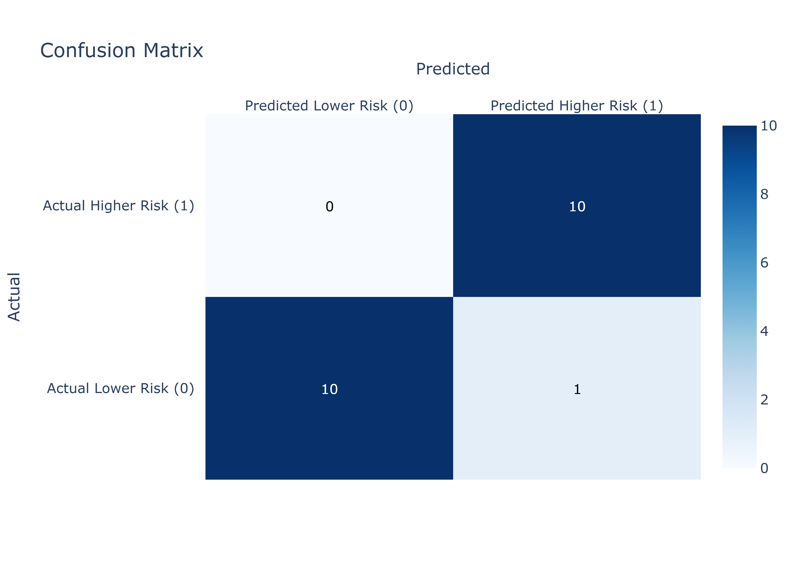

# ACL-injury-prediction-demo

This is a simplified version of a private repo for ACL injury prediction using ML. 

All confidential data, models, and results are removed.
More will be release upon acceptance of the article.

Learnt structure in data:

Prediction outcome:

